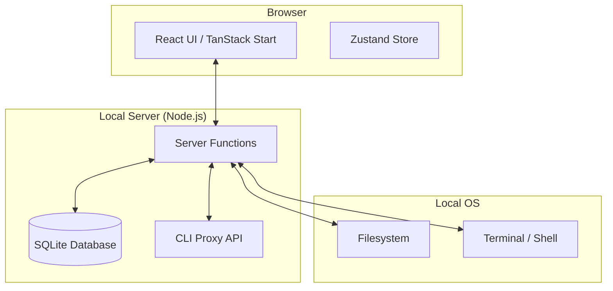

# Architecture Overview

Nxus is built with a modern, local-first stack designed for performance, reliability, and ease of development.

## Tech Stack

- **Framework**: [TanStack Start](https://tanstack.com/start) - A full-stack React framework with built-in server functions.
- **Language**: TypeScript - Ensuring type safety across the entire stack.
- **Database**: SQLite - A file-based database that lives on your machine.
- **Styling**: Vanilla CSS with [Tailwind CSS](https://tailwindcss.com/) utilities (where applicable) and [Radix UI](https://www.radix-ui.com/) for primitives.
- **Icons**: [Phosphor Icons](https://phosphoricons.com/).

## System Architecture

Nxus operates as a hybrid application. While you interact with it in a web browser, it has full access to your local system through **Server Functions**.

### Server Functions: The Bridge

Because browsers are sandboxed for security, they cannot directly run shell commands or access your files. Nxus uses TanStack Start's Server Functions to securely execute these actions on your behalf. When you click "Install" or "Run," the UI sends a request to the server, which then interacts with your OS.

### Local-First Data

All your metadata, tags, and relationships are stored in a local SQLite database. This ensures:

- **Zero Latency**: UI updates are nearly instantaneous.
- **Offline Access**: Everything works even without an internet connection (except for remote actions like `git clone`).
- **Privacy**: Your data never leaves your machine unless you explicitly push it.

## Key Components

1. **Registry**: A collection of `manifest.json` files that define tools and their capabilities.
2. **Node Service**: The core logic for querying and manipulating the graph database.
3. **Execution Engine**: Handles running commands, capturing output, and streaming it back to the UI in real-time.
4. **Command Palette**: The unified search and execution interface.

---

Next: Learn about our [Data Model](data-model.md) and how we use nodes and supertags.
