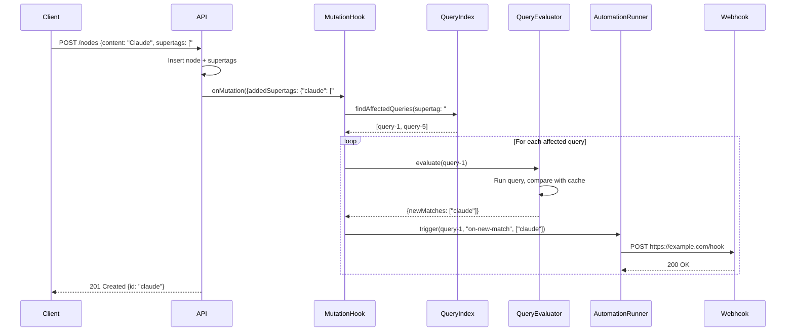
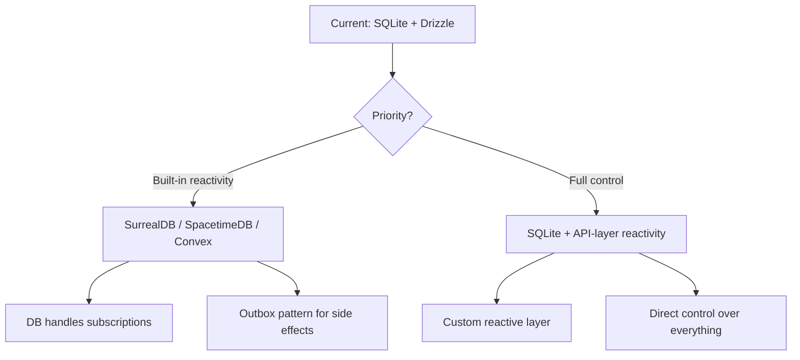

# Tana-like Node Architecture for Nxus

A comprehensive plan for a unified node-based data layer with reactive API capabilities.

---

## Table of Contents

1. [Performance Analysis](#part-1-performance-analysis)
2. [Reactive Backend Options](#part-2-reactive-backend-options)
3. [Recommendation](#part-3-recommendation)
4. [Node Architecture](#part-4-node-architecture)
5. [Automation Examples](#part-5-automation-examples)
6. [Reactive Query Subscriptions](#part-6-reactive-query-subscriptions)
7. [**Alternative Architectures (NEW)**](#part-7-alternative-architectures)

---

## Part 6: Reactive Query Subscriptions

> This section addresses: _How do saved queries re-evaluate when mutations occur, triggering webhooks for new matches?_

### The Core Problem

```
┌───────────────────────────────────────────────────────────────────┐
│  User creates Saved Query:                                        │
│  "Find all nodes with #Item supertag"                            │
│  + Automation: "On new match → trigger webhook"                  │
└───────────────────────────────────────────────────────────────────┘
                                ▼
┌───────────────────────────────────────────────────────────────────┐
│  API receives: POST /nodes                                        │
│  Body: { content: "Claude Code", supertags: ["#Item", "#Tool"] } │
└───────────────────────────────────────────────────────────────────┘
                                ▼
┌───────────────────────────────────────────────────────────────────┐
│  System must:                                                     │
│  1. Insert the new node                                          │
│  2. Find all saved queries that might match this node            │
│  3. Check if node is a NEW match (wasn't in results before)      │
│  4. For new matches, trigger associated automations              │
└───────────────────────────────────────────────────────────────────┘
```

### Solution Architecture

#### Saved Queries as Nodes

Queries are nodes with `#Query` supertag:

```typescript
// Node: saved-query-1
{
  id: "saved-query-1",
  content: "All Items",
  supertags: ["supertag:query"],
  properties: {
    // Query definition (stored as JSON)
    "field:query-definition": {
      filters: [
        { field: "supertag", op: "contains", value: "supertag:item" }
      ],
      sort: { field: "createdAt", direction: "desc" }
    },
    // Cached result set (node IDs that currently match)
    "field:result-cache": ["claude-code", "nodejs", "git", ...],
    // Last evaluation timestamp
    "field:evaluated-at": 1705581234567
  }
}

// Automation linked to the query
{
  id: "automation-1",
  content: "Notify on new Item",
  supertags: ["supertag:automation"],
  properties: {
    "field:trigger-query": "saved-query-1",  // Reference to query node
    "field:trigger-event": "on-new-match",   // or "on-removed", "on-any-change"
    "field:action-type": "webhook",
    "field:webhook-url": "https://example.com/webhook",
    "field:webhook-payload-template": "{ \"nodeId\": \"{{nodeId}}\" }"
  }
}
```

#### Mutation Hook System

Every mutation flows through a central hook:

```typescript
// mutation-hooks.ts

interface MutationResult {
  affectedNodeIds: string[];
  addedSupertags: Map<string, string[]>; // nodeId → [supertagIds]
  removedSupertags: Map<string, string[]>;
  changedProperties: Map<string, string[]>; // nodeId → [fieldIds]
}

async function onMutation(result: MutationResult) {
  // 1. Find potentially affected queries
  const queries = await findQueriesThatMightBeAffected(result);

  // 2. For each query, check if results changed
  for (const query of queries) {
    const previousResults = new Set(query.resultCache);
    const currentResults = await evaluateQuery(query.definition);

    // 3. Calculate deltas
    const newMatches = currentResults.filter((id) => !previousResults.has(id));
    const removedMatches = [...previousResults].filter(
      (id) => !currentResults.has(id),
    );

    // 4. Update cache
    await updateQueryResultCache(query.id, [...currentResults]);

    // 5. Trigger automations
    if (newMatches.length > 0) {
      await triggerAutomations(query.id, "on-new-match", newMatches);
    }
    if (removedMatches.length > 0) {
      await triggerAutomations(query.id, "on-removed", removedMatches);
    }
  }
}
```

#### Finding Affected Queries (Optimization)

**Naive approach:** Re-evaluate ALL queries on every mutation (expensive!)

**Smart approach:** Index queries by their filter dependencies:

```typescript
// Query Dependency Index
// Maps: (filter type, filter value) → [query IDs]

const queryDependencyIndex = {
  // Queries that filter by supertag
  "supertag:supertag:item": ["saved-query-1", "saved-query-5"],
  "supertag:supertag:tool": ["saved-query-2"],

  // Queries that filter by field value
  "field:field:status=installed": ["saved-query-3"],

  // Queries that match ANY node (need to evaluate on every mutation)
  "*": ["saved-query-4"],
};

async function findQueriesThatMightBeAffected(
  result: MutationResult,
): Promise<Query[]> {
  const affectedQueryIds = new Set<string>();

  // Check supertag changes
  for (const [nodeId, supertags] of result.addedSupertags) {
    for (const supertagId of supertags) {
      const queries = queryDependencyIndex[`supertag:${supertagId}`] || [];
      queries.forEach((id) => affectedQueryIds.add(id));
    }
  }

  // Check property changes
  for (const [nodeId, fields] of result.changedProperties) {
    for (const fieldId of fields) {
      // Find queries that filter on this field
      const matchingKeys = Object.keys(queryDependencyIndex).filter((k) =>
        k.startsWith(`field:${fieldId}`),
      );
      matchingKeys.forEach((key) => {
        queryDependencyIndex[key].forEach((id) => affectedQueryIds.add(id));
      });
    }
  }

  // Always include wildcard queries
  queryDependencyIndex["*"]?.forEach((id) => affectedQueryIds.add(id));

  return loadQueries([...affectedQueryIds]);
}
```

### Implementation in Convex

Convex makes this significantly easier because:

1. **Triggers run in the same transaction** as mutations
2. **Reactive queries** automatically track dependencies
3. **Scheduled functions** can handle async webhook delivery

```typescript
// convex/triggers.ts
import { Triggers } from "convex-helpers/server/triggers";
import { DataModel } from "./_generated/dataModel";

const triggers = new Triggers<DataModel>();

// Trigger on nodeSupertags changes
triggers.register("nodeSupertags", async (ctx, change) => {
  if (change.operation === "insert") {
    const { nodeId, supertagNodeId } = change.newDoc;

    // Find queries that filter by this supertag
    const affectedQueries = await ctx.db
      .query("queryDependencies")
      .filter((q) => q.eq(q.field("dependsOnSupertag"), supertagNodeId))
      .collect();

    for (const dep of affectedQueries) {
      // Schedule async evaluation (doesn't block mutation)
      await ctx.scheduler.runAfter(0, "evaluateQueryAndTrigger", {
        queryId: dep.queryId,
        triggerNodeId: nodeId,
        event: "potential-new-match",
      });
    }
  }
});

export const mutationWithTriggers = customMutation(mutation, triggers);

// convex/queryEvaluation.ts
export const evaluateQueryAndTrigger = internalMutation({
  args: {
    queryId: v.id("nodes"),
    triggerNodeId: v.id("nodes"),
    event: v.string(),
  },
  handler: async (ctx, { queryId, triggerNodeId, event }) => {
    const query = await ctx.db.get(queryId);
    const definition = JSON.parse(query.properties["field:query-definition"]);

    // Get cached results
    const previousResults = new Set(
      JSON.parse(query.properties["field:result-cache"] || "[]"),
    );

    // Re-evaluate query
    const currentResults = await executeQuery(ctx, definition);
    const currentSet = new Set(currentResults.map((n) => n._id));

    // Check if trigger node is a NEW match
    if (currentSet.has(triggerNodeId) && !previousResults.has(triggerNodeId)) {
      // Find automations for this query
      const automations = await ctx.db
        .query("nodeRelations")
        .filter((q) => q.eq(q.field("fieldNodeId"), "field:trigger-query"))
        .filter((q) => q.eq(q.field("targetId"), queryId))
        .collect();

      for (const automation of automations) {
        const autoNode = await ctx.db.get(automation.sourceId);
        if (autoNode.properties["field:trigger-event"] === "on-new-match") {
          // Schedule webhook delivery
          await ctx.scheduler.runAfter(0, "deliverWebhook", {
            automationId: automation.sourceId,
            matchedNodeId: triggerNodeId,
          });
        }
      }
    }

    // Update cache
    await ctx.db.patch(queryId, {
      properties: {
        ...query.properties,
        "field:result-cache": JSON.stringify([...currentSet]),
        "field:evaluated-at": Date.now(),
      },
    });
  },
});

// convex/webhooks.ts
export const deliverWebhook = internalAction({
  args: { automationId: v.id("nodes"), matchedNodeId: v.id("nodes") },
  handler: async (ctx, { automationId, matchedNodeId }) => {
    const automation = await ctx.runQuery("getNode", { id: automationId });
    const matchedNode = await ctx.runQuery("getNode", { id: matchedNodeId });

    const url = automation.properties["field:webhook-url"];
    const template = automation.properties["field:webhook-payload-template"];

    // Render template
    const payload = template
      .replace("{{nodeId}}", matchedNode._id)
      .replace("{{nodeContent}}", matchedNode.content)
      .replace("{{timestamp}}", new Date().toISOString());

    // Deliver webhook
    await fetch(url, {
      method: "POST",
      headers: { "Content-Type": "application/json" },
      body: payload,
    });

    // Log delivery
    await ctx.runMutation("logWebhookDelivery", {
      automationId,
      nodeId: matchedNodeId,
      status: "delivered",
      timestamp: Date.now(),
    });
  },
});
```

### SQLite Implementation (DIY Approach)

If staying on SQLite, you need to build this yourself:

```typescript
// sqlite-reactive.ts

import { db } from "./db";

// After every mutation, check for query re-evaluation
export async function afterMutation(changes: ChangeSet) {
  // Option 1: Synchronous (simple but blocks response)
  await evaluateAffectedQueries(changes);

  // Option 2: Async via queue (recommended)
  await pushToEvaluationQueue(changes);
}

// Background worker that processes the queue
async function processEvaluationQueue() {
  while (true) {
    const change = await popFromQueue();
    if (!change) {
      await sleep(100); // Poll interval
      continue;
    }

    const queries = await findAffectedQueries(change);
    for (const query of queries) {
      await evaluateAndTrigger(query, change);
    }
  }
}

// Alternative: Use SQLite triggers + WAL
// Write changes to a dedicated "mutation_log" table
// Background worker reads from this log

const CREATE_MUTATION_LOG = `
  CREATE TABLE mutation_log (
    id INTEGER PRIMARY KEY AUTOINCREMENT,
    table_name TEXT NOT NULL,
    operation TEXT NOT NULL,  -- INSERT, UPDATE, DELETE
    node_id TEXT NOT NULL,
    changed_data TEXT,        -- JSON of changes
    processed_at INTEGER,
    created_at INTEGER DEFAULT (unixepoch())
  );
  
  CREATE INDEX idx_mutation_log_unprocessed 
    ON mutation_log(processed_at) WHERE processed_at IS NULL;
`;

// Trigger to log mutations
const CREATE_NODE_TRIGGER = `
  CREATE TRIGGER log_node_supertag_insert
  AFTER INSERT ON node_supertags
  BEGIN
    INSERT INTO mutation_log (table_name, operation, node_id, changed_data)
    VALUES ('node_supertags', 'INSERT', NEW.node_id, 
      json_object('supertagNodeId', NEW.supertag_node_id));
  END;
`;
```

### Flow Diagram



### Performance Considerations

| Approach            | Latency Impact         | Complexity | Reliability         |
| ------------------- | ---------------------- | ---------- | ------------------- |
| **Sync in request** | High (blocks response) | Low        | Highest (atomic)    |
| **Async queue**     | None                   | Medium     | Good (with retries) |
| **Convex triggers** | Low (same transaction) | Low        | Highest             |
| **CDC/WAL polling** | None                   | High       | Good                |

**Recommendation:** Use Convex triggers for the reactive core, with scheduled functions for webhook delivery. This gives you:

- Atomic evaluation (triggers run in mutation transaction)
- Non-blocking webhooks (scheduled as async actions)
- Built-in retries for failed deliveries

### Query Definition Schema

```typescript
interface QueryDefinition {
  filters: QueryFilter[];
  sort?: { field: string; direction: "asc" | "desc" };
  limit?: number;
}

type QueryFilter =
  | { type: "supertag"; supertagId: string }
  | { type: "extends-supertag"; supertagId: string } // Include inherited
  | { type: "property"; fieldId: string; op: FilterOp; value: unknown }
  | { type: "relation"; fieldId: string; targetId: string }
  | { type: "has-backlink"; fromFieldId: string }
  | { type: "and"; filters: QueryFilter[] }
  | { type: "or"; filters: QueryFilter[] }
  | { type: "not"; filter: QueryFilter };

type FilterOp =
  | "eq"
  | "neq"
  | "gt"
  | "gte"
  | "lt"
  | "lte"
  | "contains"
  | "startsWith";
```

---

## Part 7: Alternative Architectures

You asked: _Would a graph DB like Neo4j with reactive layers, or ECS patterns solve this more elegantly?_

**Short answer:** Yes, there are purpose-built solutions. Here's the analysis:

---

### Option A: Neo4j + Reactive Layer

**What Neo4j provides:**

- Native graph storage (nodes + relationships as first-class)
- APOC triggers (run Cypher on INSERT/UPDATE/DELETE)
- Change Data Capture (CDC) for streaming changes
- GraphQL subscriptions (powered by CDC)

**Architecture:**

```
┌─────────────────┐     ┌─────────────────┐     ┌─────────────────┐
│  Nxus Frontend  │────▶│   Neo4j DB      │────▶│  Kafka/Stream   │
│                 │     │  (graph)        │     │  (CDC events)   │
└─────────────────┘     └─────────────────┘     └────────┬────────┘
                                                         │
                                              ┌──────────▼──────────┐
                                              │  Automation Worker  │
                                              │  (evaluates queries │
                                              │   triggers webhooks)│
                                              └─────────────────────┘
```

**Pros:**
| ✅ Advantage | Details |
|-------------|---------|
| Native graph model | Relationships are first-class, no JOIN performance issues |
| APOC triggers | Run logic on mutation, similar to Convex triggers |
| CDC built-in | Stream all changes to Kafka/external systems |
| GraphQL subscriptions | Real-time updates to frontend via WebSocket |
| Cypher queries | Powerful graph traversal (backlinks, paths) |

**Cons:**
| ❌ Disadvantage | Details |
|----------------|---------|
| Heavy for local app | Neo4j is a server, not embeddable like SQLite |
| Self-hosting complexity | JVM-based, needs dedicated process |
| No native "saved query triggers" | CDC is table-level, not query-level |
| Learning curve | Cypher is different from SQL |

**Verdict:** Neo4j is great for the graph model, but you'd **still need to build** the custom reactive query subscription layer (Part 6) on top of CDC. It doesn't solve that problem automatically.

---

### Option B: ECS (Entity Component System)

**What ECS provides:**

- Entities = IDs (like our nodes)
- Components = data bags (like our properties)
- Systems = logic that queries entities by components (like our queries)

**The Reactive ECS insight:**

Traditional ECS polls every frame. **Reactive ECS** inverts this:

- Systems **subscribe** to component combinations
- Manager dispatches entities to systems **only when relevant data changes**
- Zero per-frame query cost

**Mapping to our problem:**

```
┌─────────────────────────────────────────────────────────────────┐
│  ECS Concept              │  Nxus Equivalent                    │
├───────────────────────────┼─────────────────────────────────────┤
│  Entity                   │  Node                               │
│  Component                │  Field value (nodeProperties)       │
│  Archetype (component set)│  Supertag combination               │
│  System                   │  Saved Query + Automation           │
│  Query subscription       │  Our query dependency index         │
└─────────────────────────────────────────────────────────────────┘
```

**The pattern we're building IS essentially a Reactive ECS:**

1. Nodes are entities
2. Properties are components
3. Saved queries are "systems" that subscribe to archetypes (supertags)
4. Mutations dispatch to subscribed systems

**Takeaway:** ECS validates the architecture, but doesn't provide an off-the-shelf solution. We're building the same pattern, just with database persistence.

---

### Option C: SurrealDB (Best Match! 🎯)

> [!IMPORTANT]
> **SurrealDB has LIVE SELECT** - exactly the feature you described!

**What SurrealDB provides:**

- Multi-model: Document + Graph + Relational in one
- `LIVE SELECT` - native reactive queries
- Built-in graph relationships (edges as first-class)
- Embeddable or server mode
- Rust-based, fast, self-hostable

**LIVE SELECT example:**

```sql
-- Subscribe to all Items
LIVE SELECT * FROM nodes WHERE supertags CONTAINS 'supertag:item';

-- The database PUSHES changes to your subscription:
-- { action: "CREATE", result: { id: "claude-code", ... } }
-- { action: "UPDATE", result: { id: "nodejs", ... } }
-- { action: "DELETE", result: { id: "old-tool", ... } }
```

**Architecture with SurrealDB:**

```
┌─────────────────┐     ┌─────────────────┐
│  Nxus Frontend  │────▶│   SurrealDB     │
│  (WebSocket)    │◀────│  (LIVE SELECT)  │
└─────────────────┘     └────────┬────────┘
                                 │ Change events
                                 ▼
                        ┌─────────────────┐
                        │  Automation     │
                        │  Handler        │
                        │  (webhooks)     │
                        └─────────────────┘
```

**How your flow works:**

```typescript
// 1. Create saved query as a LIVE subscription
const subscription = await db.live('nodes', {
  where: { supertags: { contains: 'supertag:item' } }
});

// 2. Listen for changes
subscription.on('create', async (node) => {
  // This fires automatically when new Item is added!
  await triggerWebhook(node);
});

subscription.on('update', async (node) => { ... });
subscription.on('delete', async (node) => { ... });

// 3. Add node via generic API
await db.create('nodes', {
  id: 'claude-code',
  content: 'Claude Code',
  supertags: ['supertag:item', 'supertag:tool']
});
// → subscription.on('create') fires automatically!
```

---

### Option D: SpacetimeDB (ECS-Inspired! 🎮)

> [!NOTE]
> SpacetimeDB is designed for games but its architecture maps perfectly to your ECS analogy!

**What SpacetimeDB provides:**

- **In-memory relational DB** with WAL persistence
- **Subscriptions** - clients subscribe to SQL queries, get streaming updates
- **Reducers** - server-side functions that run IN the database (like Convex)
- **Automatic sync** - client SDK maintains local cache
- TypeScript SDK for client
- Rust/C# for server modules (WASM)

**How it maps to ECS:**

```
┌─────────────────────────────────────────────────────────────────┐
│  ECS Concept              │  SpacetimeDB Equivalent             │
├───────────────────────────┼─────────────────────────────────────┤
│  Entity                   │  Table row (with ID)                │
│  Component                │  Column value                       │
│  Archetype                │  Table (all rows have same columns) │
│  System                   │  Subscription query + Reducer       │
│  Reactive dispatch        │  Subscription callbacks on change   │
└─────────────────────────────────────────────────────────────────┘
```

**Subscription example:**

```typescript
// Client subscribes to a SQL query
const subscription = await db.subscribe(
  "SELECT * FROM nodes WHERE 'supertag:item' IN supertags"
);

// Local cache is automatically maintained
// Callbacks fire on changes
subscription.onInsert((node) => {
  // New item added! Trigger webhook
  triggerWebhook(node);
});

subscription.onUpdate((oldNode, newNode) => { ... });
subscription.onDelete((node) => { ... });
```

**Reducer example (server-side logic):**

```rust
// Runs IN the database, atomic transaction
#[spacetimedb::reducer]
fn add_node(ctx: &ReducerContext, content: String, supertags: Vec<String>) {
    // Insert creates change events automatically
    ctx.db.insert(Node {
        id: ctx.db.generate_id(),
        content,
        supertags,
    });

    // Subscribers with matching queries get notified!
}
```

**SpacetimeDB vs SurrealDB:**

| Aspect             | SurrealDB             | SpacetimeDB                |
| ------------------ | --------------------- | -------------------------- |
| **Query language** | SurrealQL (SQL-like)  | SQL                        |
| **Server logic**   | ❌ Query only         | ✅ Reducers (WASM)         |
| **Graph model**    | ✅ Native edges       | ❌ Relations via FK        |
| **In-memory**      | Optional              | ✅ Always (fast!)          |
| **Multi-node**     | ✅ Supported          | ❌ Single-node (self-host) |
| **Maturity**       | More mature           | Newer, game-focused        |
| **Best for**       | General reactive apps | Game-like real-time apps   |

---

**Comparison Table (All Options):**

| Feature                 | SQLite + DIY      | Convex          | Neo4j             | SurrealDB             | **SpacetimeDB**      |
| ----------------------- | ----------------- | --------------- | ----------------- | --------------------- | -------------------- |
| Graph relationships     | ❌ Simulated      | ❌ Simulated    | ✅ Native         | ✅ Native             | ❌ Relational        |
| Reactive queries        | ❌ Build yourself | ⚠️ Client-side  | ❌ CDC only       | ✅ LIVE SELECT        | ✅ **Subscriptions** |
| Query-level triggers    | ❌ Build yourself | ⚠️ Via triggers | ❌ Build yourself | ✅ Native             | ✅ **Reducers**      |
| Self-hostable           | ✅ Embedded       | ✅ Docker       | ✅ Docker         | ✅ Embedded or Docker | ✅ Docker (single)   |
| TypeScript-first        | ⚠️ Drizzle        | ✅ Native       | ❌ Java/Cypher    | ✅ SDK                | ⚠️ TS client¹        |
| Offline support         | ✅ Native         | ⚠️ Limited      | ❌ No             | ⚠️ In development     | ⚠️ Client cache      |
| Migration effort        | ✅ None           | ⚠️ Moderate     | ❌ High           | ⚠️ Moderate           | ⚠️ Rust schema²      |
| Server logic in DB      | ❌                | ✅ Functions    | ❌                | ❌                    | ✅ **Reducers**      |
| **Reactivity built-in** | ❌                | ⚠️ Partial      | ⚠️ Partial        | ✅ **Full**           | ✅ **Full**          |

**SpacetimeDB Footnotes:**

¹ **"TS client"**: TypeScript SDK works for querying/subscribing, but you must define your **schema and reducers in Rust**. The CLI generates TypeScript bindings from Rust, so client code is type-safe.

² **"Rust schema"**: SpacetimeDB requires you to define tables and logic as a "module" in Rust or C#. This is not like traditional DBs where you just write SQL. However, if you only need basic CRUD + subscriptions (no custom server logic), the Rust code is minimal:

```rust
// Minimal schema definition - this is ALL you need for basic CRUD
#[spacetimedb::table(public)]
pub struct Node {
    #[primary_key]
    pub id: String,
    pub content: String,
    pub supertags: Vec<String>,
}

// Optional: custom reducer for complex logic
#[spacetimedb::reducer]
fn add_node(ctx: &ReducerContext, id: String, content: String) {
    ctx.db.node().insert(Node { id, content, supertags: vec![] });
}
```

> [!TIP]
> If Rust is a blocker, **SurrealDB** offers similar reactivity with pure TypeScript/SQL.

---

### Updated Recommendation



**Final Recommendations:**

| Approach | Pros | Cons | Best For |
|----------|------|------|----------|
| **SurrealDB** | LIVE SELECT, graph, TypeScript | Newer, LIVE SELECT single-node | Reactive + graph queries |
| **SpacetimeDB** | ECS subscriptions, TS modules now | Gaming-focused, less mature | Real-time multiplayer |
| **Convex** | TypeScript DX, actions for side effects | Need custom query subscriptions | Full-stack TypeScript |
| **SQLite + DIY** | Full control, offline, no lock-in | Build reactive layer yourself | Max flexibility |

**Key Insight: Outbox Pattern**

All reactive DBs can handle external side effects via outbox:

```
Reducer (pure) → Insert to `events` table → Worker (any side effects)
```

So the real question is: **Build vs Buy** the reactive subscription system.

---

## Conclusion

The **node architecture (Parts 4-6) is database-agnostic**. Choose based on:

1. **Want built-in reactivity?** → SurrealDB (LIVE SELECT) or Convex
2. **Want full control?** → SQLite + build reactive layer (Part 6)
3. **Both are viable** → Outbox pattern bridges side effects either way

## Next Steps

1. **Decide**: Built-in reactivity (SurrealDB/Convex) vs DIY (SQLite)?
2. **If SurrealDB**: Spike on LIVE SELECT with node queries
3. **If SQLite**: Implement reactive layer per Part 6
4. **Either way**: Implement node schema (Part 4)

