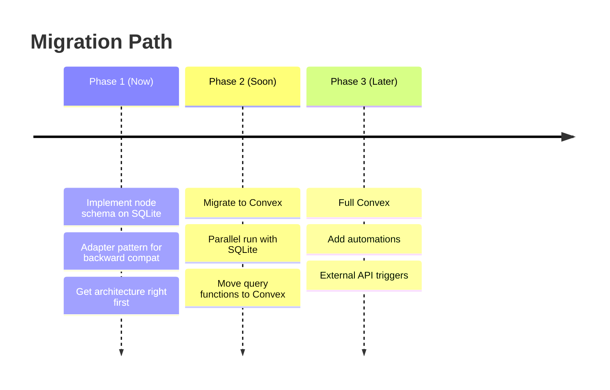

# Tana-like Node Architecture for Nxus

A comprehensive plan for a unified node-based data layer with reactive API capabilities.

---

## Executive Summary

This plan proposes a **node-based architecture** where everything (including supertags and fields) is a node, combined with evaluation of **reactive backend options** for Notion-like automations.

> [!IMPORTANT]
> **New Section Added:** Performance implications and Convex vs SQLite+ElectricSQL comparison based on your reactivity requirements.

---

## Part 1: Performance Analysis

### Node Architecture Performance Implications

#### Query Complexity

| Current Architecture | Node Architecture | Impact |
|---------------------|-------------------|--------|
| `SELECT * FROM items` | Join `nodes` + `nodeSupertags` + `nodeProperties` | **More joins** |
| Direct column access | Property lookup by field ID | **Indirection overhead** |
| Type-specific indexes | Generic property indexes | **Broader index scans** |

#### Mitigation Strategies

1. **Materialized Views** for hot paths:
   ```sql
   CREATE VIEW items_view AS
   SELECT n.id, n.content as name, 
          p1.value as type, p2.value as path
   FROM nodes n
   JOIN nodeSupertags ns ON n.id = ns.nodeId AND ns.supertagNodeId = 'supertag:item'
   LEFT JOIN nodeProperties p1 ON n.id = p1.nodeId AND p1.fieldNodeId = 'field:type'
   LEFT JOIN nodeProperties p2 ON n.id = p2.nodeId AND p2.fieldNodeId = 'field:path';
   ```

2. **Denormalized Cache** for registry service (already in-memory)

3. **Index Strategy**:
   ```sql
   CREATE INDEX idx_node_supertags_supertag ON node_supertags(supertag_node_id);
   CREATE INDEX idx_node_properties_field ON node_properties(field_node_id);
   CREATE INDEX idx_node_relations_target ON node_relations(target_id); -- For backlinks
   ```

4. **Supertag Inheritance Caching** - pre-compute inheritance trees

#### Expected Performance

| Operation | Current | Node-Based | Notes |
|-----------|---------|------------|-------|
| Get all items | ~5ms | ~15-25ms | More joins, but cacheable |
| Get single item | ~1ms | ~3-5ms | Acceptable |
| Graph view (100 items) | ~50ms | ~80-120ms | Relations already joined |
| Backlinks query | N/A | ~10-20ms | New capability |

> [!NOTE]
> For a local-first registry app with ~200 items, these differences are imperceptible. The architectural benefits outweigh the microsecond costs.

---

## Part 2: Reactive Backend Options

### Your Requirements

1. **Reactive at API layer** - not just frontend, but external systems can subscribe
2. **Notion-like automations** - triggers when data changes, execute actions
3. **Self-hostable** - run on your own infrastructure
4. **Node-based flexibility** - schema-flexible for the Tana-like model

### Option A: SQLite + ElectricSQL

**Architecture:**
```
┌─────────────────┐     ┌─────────────────┐     ┌─────────────────┐
│  Nxus Frontend  │────▶│  SQLite (local) │◀───▶│  ElectricSQL    │
│  (React/TanStack)│     │  (source of     │     │  Sync Service   │
└─────────────────┘     │   truth)        │     │  (Postgres)     │
                        └─────────────────┘     └─────────────────┘
                                                       ▲
                                                       │
                                              ┌────────┴────────┐
                                              │ External APIs   │
                                              │ (Webhooks, MCP) │
                                              └─────────────────┘
```

| Pros | Cons |
|------|------|
| ✅ Keep current SQLite | ❌ Reactivity is client→server only |
| ✅ Offline-first by design | ❌ No built-in server-side triggers |
| ✅ Postgres power for complex queries | ❌ Automations require custom layer |
| ✅ Self-hostable (Elixir service) | ❌ Two databases to manage |
| ✅ CRDT-based conflict resolution | ❌ More moving parts |

**Automation Strategy:** Build custom trigger system on Postgres:
- Use Postgres `NOTIFY`/`LISTEN` + triggers
- External worker process for automation execution
- More DIY work

### Option B: Convex

**Architecture:**
```
┌─────────────────┐     ┌─────────────────┐     
│  Nxus Frontend  │────▶│    Convex       │◀──── External APIs
│  (React)        │     │  (reactive DB   │       (HTTP Actions)
└─────────────────┘     │   + functions)  │
                        └─────────────────┘
                               │
                               ▼
                        ┌─────────────────┐
                        │  Self-Hosted    │
                        │  (Docker/SQLite)│
                        └─────────────────┘
```

| Pros | Cons |
|------|------|
| ✅ **Native reactivity** - subscriptions built-in | ❌ Migration from Drizzle/SQLite |
| ✅ **TypeScript-first** - end-to-end type safety | ❌ Learning curve (different paradigm) |
| ✅ **Scheduled functions** - cron-like automation | ❌ No SQL (TypeScript queries) |
| ✅ **HTTP Actions** - external API triggers | ❌ Document model (not relational) |
| ✅ **Self-hostable** (Docker, uses SQLite internally) | ❌ Less mature than Postgres ecosystem |
| ✅ **Schema-optional** - perfect for node model | |

**Automation in Convex:**
```typescript
// Scheduled function (runs every hour)
export const checkDueItems = scheduledMutation({
  schedule: "0 * * * *", // cron
  handler: async (ctx) => {
    const overdue = await ctx.db.query("nodes")
      .filter(q => q.lt(q.field("dueDate"), Date.now()))
      .collect();
    // Send notifications, update statuses, etc.
  }
});

// Trigger on mutation (reactive)
export const onItemCreated = mutation({
  handler: async (ctx, { nodeId }) => {
    await ctx.scheduler.runAfter(0, "sendNotification", { nodeId });
  }
});
```

### Option C: Hybrid (SQLite Now, Convex Later)

**Recommended Approach:**



**Rationale:**
1. **Node schema is backend-agnostic** - works on SQLite or Convex
2. **Convex uses SQLite internally** - migration path is smooth
3. **Get the data model right first** - harder to change later
4. **Reactivity can be added incrementally** - not all-or-nothing

---

## Part 3: Recommendation

### Decision Matrix

| Criterion | Weight | SQLite+Electric | Convex | Winner |
|-----------|--------|-----------------|--------|--------|
| **Reactivity at API layer** | 30% | 6/10 (needs custom) | 10/10 (native) | Convex |
| **Notion-like automations** | 25% | 5/10 (DIY) | 9/10 (scheduled/triggers) | Convex |
| **Self-hosting ease** | 15% | 7/10 (Elixir + Postgres) | 8/10 (Docker) | Convex |
| **Migration effort** | 15% | 9/10 (keep SQLite) | 5/10 (new paradigm) | Electric |
| **Schema flexibility** | 15% | 7/10 (relational) | 9/10 (document) | Convex |
| **TOTAL** | | 6.7 | 8.5 | **Convex** |

### Recommended Strategy

> [!TIP]
> **Implement node architecture on SQLite first, then migrate to Convex.**

**Phase 1: Node Schema on SQLite (1-2 weeks)**
- Create tables: `nodes`, `nodeSupertags`, `supertagExtends`, `nodeProperties`, `nodeRelations`
- Implement adapters for backward compatibility
- Validate data model is correct
- UI continues working via adapters

**Phase 2: Convex Migration (2-3 weeks)**
- Set up self-hosted Convex (Docker)
- Migrate schema (nearly 1:1 since Convex uses documents)
- Replace Drizzle queries with Convex queries
- Add real-time subscriptions to React

**Phase 3: Automation Layer (1-2 weeks)**
- Implement scheduled functions for cron jobs
- Add mutation triggers for reactive workflows
- Expose HTTP actions for external API integration
- Build automation UI (like Notion's trigger→action builder)

---

## Part 4: Node Architecture (Updated)

### Core Tables (SQLite Phase 1)

```typescript
// nodes - universal entities
export const nodes = sqliteTable('nodes', {
  id: text('id').primaryKey(),
  content: text('content'),
  contentPlain: text('content_plain'),
  ownerId: text('owner_id'),
  createdAt: integer('created_at', { mode: 'timestamp' }),
  updatedAt: integer('updated_at', { mode: 'timestamp' }),
  deletedAt: integer('deleted_at', { mode: 'timestamp' }),
})

// nodeSupertags - type assignments
export const nodeSupertags = sqliteTable('node_supertags', {
  nodeId: text('node_id').notNull(),
  supertagNodeId: text('supertag_node_id').notNull(),
  order: integer('order').default(0),
}, (t) => [primaryKey({ columns: [t.nodeId, t.supertagNodeId] })])

// supertagExtends - inheritance
export const supertagExtends = sqliteTable('supertag_extends', {
  childId: text('child_id').notNull(),
  parentId: text('parent_id').notNull(),
}, (t) => [primaryKey({ columns: [t.childId, t.parentId] })])

// nodeProperties - field values
export const nodeProperties = sqliteTable('node_properties', {
  id: integer('id').primaryKey({ autoIncrement: true }),
  nodeId: text('node_id').notNull(),
  fieldNodeId: text('field_node_id').notNull(),
  value: text('value'),
  order: integer('order').default(0),
})

// nodeRelations - edges (for reference-type fields)
export const nodeRelations = sqliteTable('node_relations', {
  id: integer('id').primaryKey({ autoIncrement: true }),
  sourceId: text('source_id').notNull(),
  targetId: text('target_id').notNull(),
  fieldNodeId: text('field_node_id'),
  order: integer('order').default(0),
})
```

### Convex Equivalent (Phase 2)

```typescript
// convex/schema.ts
import { defineSchema, defineTable } from "convex/server";
import { v } from "convex/values";

export default defineSchema({
  nodes: defineTable({
    content: v.optional(v.string()),
    contentPlain: v.optional(v.string()),
    ownerId: v.optional(v.id("nodes")),
    deletedAt: v.optional(v.number()),
  }),
  
  nodeSupertags: defineTable({
    nodeId: v.id("nodes"),
    supertagNodeId: v.id("nodes"),
    order: v.number(),
  }).index("by_node", ["nodeId"])
    .index("by_supertag", ["supertagNodeId"]),
  
  nodeProperties: defineTable({
    nodeId: v.id("nodes"),
    fieldNodeId: v.id("nodes"),
    value: v.optional(v.string()),
    order: v.number(),
  }).index("by_node", ["nodeId"]),
  
  nodeRelations: defineTable({
    sourceId: v.id("nodes"),
    targetId: v.id("nodes"),
    fieldNodeId: v.optional(v.id("nodes")),
    order: v.number(),
  }).index("by_source", ["sourceId"])
    .index("by_target", ["targetId"]), // For backlinks!
});
```

---

## Part 5: Automation Examples

### Notion-Style Triggers in Convex

```typescript
// convex/automations.ts

// Trigger: When node gets #Item supertag, run health check
export const onItemTagged = mutation({
  args: { nodeId: v.id("nodes") },
  handler: async (ctx, { nodeId }) => {
    const node = await ctx.db.get(nodeId);
    const hasItemTag = await ctx.db
      .query("nodeSupertags")
      .filter(q => q.eq(q.field("nodeId"), nodeId))
      .filter(q => q.eq(q.field("supertagNodeId"), "supertag:item"))
      .first();
    
    if (hasItemTag) {
      // Schedule health check
      await ctx.scheduler.runAfter(0, "runHealthCheck", { nodeId });
    }
  }
});

// Scheduled: Daily dependency audit
export const dailyDependencyAudit = scheduledMutation({
  schedule: "0 9 * * *", // 9 AM daily
  handler: async (ctx) => {
    const items = await ctx.db
      .query("nodeSupertags")
      .filter(q => q.eq(q.field("supertagNodeId"), "supertag:item"))
      .collect();
    
    for (const item of items) {
      await ctx.scheduler.runAfter(0, "checkDependencies", { 
        nodeId: item.nodeId 
      });
    }
  }
});

// HTTP Action: External trigger
export const externalTrigger = httpAction(async (ctx, request) => {
  const { nodeId, action } = await request.json();
  
  if (action === "sync") {
    await ctx.runMutation("syncNode", { nodeId });
  }
  
  return new Response(JSON.stringify({ success: true }));
});
```

---

## Open Questions

1. **Timeline**: When do you want reactivity - is Phase 1 (SQLite) acceptable for now?

2. **Convex Cloud vs Self-Hosted**: Start with cloud for speed, then self-host?

3. **Automation Scope**: What specific automations do you envision?
   - Health check triggers?
   - Notification webhooks?
   - External API sync (MCP servers)?

4. **Offline Support**: Important for Nxus? (Convex needs workarounds for offline)

---

## Next Steps

1. **Approve** the node architecture fundamentals
2. **Decide**: Start with SQLite (safer) or jump to Convex (faster to reactivity)?
3. **Begin Phase 1**: Node schema implementation
