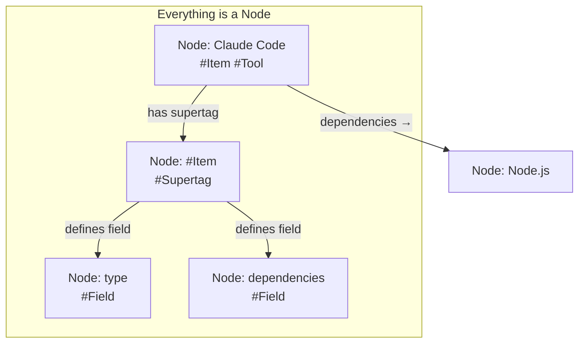

# Tana-like Node Architecture for Nxus

A comprehensive plan to build a unified node-based data layer where **everything is a node** - including supertags and fields themselves.

---

## Executive Summary

This plan proposes a **fundamental architectural shift** based on deep research into Tana's data model:

> [!IMPORTANT]
> **Key Insight from Tana:** Supertags and Fields are themselves nodes (stored in a "Schema" area). This means the type system is self-describing - you can query, reference, and extend types just like any other data.

---

## Tana Architecture Deep Dive

### Everything Is a Node

| Concept    | In Tana                   | Node Type     |
| ---------- | ------------------------- | ------------- |
| Content    | Regular nodes             | Node          |
| Types      | Supertag definition nodes | `#Supertag`   |
| Fields     | Field definition nodes    | `#Field`      |
| Workspaces | Container nodes           | `#Workspace`  |
| Searches   | Search nodes              | `#SearchNode` |

### Supertag Inheritance (Extends)

Supertags can **inherit from parent supertags**:

```
#Person
├── Fields: birthday, phone
│
└── #Author (extends #Person)
│   ├── Inherits: birthday, phone
│   └── Own fields: genres, publisher
│
└── #USPresident (extends #Person)
    ├── Inherits: birthday, phone
    └── Own fields: term, party
```

- Configuration: Go to child supertag → Advanced → "Extend an existing tag" → Select parent
- Inherited fields automatically appear on child-tagged nodes
- Searching for `#Person` returns nodes with `#Author`, `#USPresident`, etc.

### Relations via Fields

Fields create **typed, bidirectional relationships**:

```
[Book: "Dune"]
  └── Author: @Frank Herbert     ← Field referencing a #Person node

[Person: "Frank Herbert"]
  └── Appears as "Author" in: [Dune]   ← Automatic backlink
```

Field types that create relations:

- **Plain**: Any node can be pasted/referenced
- **Options from supertag**: Dropdown of all nodes with a specific supertag
- **Tana user**: References to user accounts

---

## Proposed Architecture for Nxus

### Core Principle: Nodes All the Way Down



### Database Schema

#### 1. Universal Nodes Table

```typescript
export const nodes = sqliteTable('nodes', {
  id: text('id').primaryKey(), // UUID or human-readable slug
  content: text('content'), // Primary display text
  contentPlain: text('content_plain'), // Plain text for FTS
  ownerId: text('owner_id'), // Parent node (for hierarchy)
  createdAt: integer('created_at', { mode: 'timestamp' }),
  updatedAt: integer('updated_at', { mode: 'timestamp' }),
  deletedAt: integer('deleted_at', { mode: 'timestamp' }),
});
```

#### 2. Node-Supertag Junction (Unified Instance/Extends)

```typescript
// Links nodes to supertags with relationship semantics:
// - 'instance': Regular node is an instance of the supertag
// - 'extends': Supertag node extends another supertag (inheritance)
export const nodeSupertags = sqliteTable(
  'node_supertags',
  {
    nodeId: text('node_id').notNull(),
    supertagNodeId: text('supertag_node_id').notNull(), // Points to a node with #Supertag
    relationshipType: text('relationship_type', {
      enum: ['instance', 'extends'],
    })
      .notNull()
      .default('instance'),
    order: integer('order').default(0),
    createdAt: integer('created_at', { mode: 'timestamp' }),
  },
  (t) => [primaryKey({ columns: [t.nodeId, t.supertagNodeId] })],
);
```

> [!TIP]
> **Semantic rule:** If the `nodeId` itself has `#Supertag` and uses `extends`, it's inheritance.
> Otherwise, it's a regular node being an `instance` of the supertag.

#### 3. Field Values (Properties)

```typescript
// Property values stored on nodes
export const nodeProperties = sqliteTable('node_properties', {
  id: integer('id').primaryKey({ autoIncrement: true }),
  nodeId: text('node_id').notNull(),
  fieldNodeId: text('field_node_id').notNull(), // Points to a node with #Field
  value: text('value'), // JSON-encoded value
  order: integer('order').default(0), // Multi-value ordering
  createdAt: integer('created_at', { mode: 'timestamp' }),
  updatedAt: integer('updated_at', { mode: 'timestamp' }),
});
```

#### 4. Node Relations (References)

```typescript
// Directed edges between nodes (for reference-type fields)
export const nodeRelations = sqliteTable('node_relations', {
  id: integer('id').primaryKey({ autoIncrement: true }),
  sourceId: text('source_id').notNull(), // Node with the field
  targetId: text('target_id').notNull(), // Referenced node
  fieldNodeId: text('field_node_id'), // Which field (node with #Field)
  order: integer('order').default(0),
  createdAt: integer('created_at', { mode: 'timestamp' }),
});

// Indexes for efficient querying both directions
// CREATE INDEX idx_relations_source ON node_relations(source_id)
// CREATE INDEX idx_relations_target ON node_relations(target_id) -- For backlinks!
```

---

## System Nodes (Bootstrap Schema)

These are the **foundational nodes** that bootstrap the system:

### Meta-Supertags

| Node ID             | Content   | Has Supertag       |
| ------------------- | --------- | ------------------ |
| `supertag:supertag` | #Supertag | (self-referential) |
| `supertag:field`    | #Field    | #Supertag          |
| `supertag:system`   | #System   | #Supertag          |

### System Supertags for Nxus

| Node ID              | Content    | Extends | Fields                            |
| -------------------- | ---------- | ------- | --------------------------------- |
| `supertag:item`      | #Item      | -       | type, path, homepage, status      |
| `supertag:tool`      | #Tool      | #Item   | checkCommand, installInstructions |
| `supertag:repo`      | #Repo      | #Item   | clonePath, branch                 |
| `supertag:tag`       | #Tag       | -       | color, icon, parent               |
| `supertag:command`   | #Command   | -       | mode, target, command, icon       |
| `supertag:workspace` | #Workspace | -       | path, instances                   |

### Field Definitions (Also Nodes!)

| Node ID              | Content      | Type   | Target Supertag |
| -------------------- | ------------ | ------ | --------------- |
| `field:type`         | type         | select | -               |
| `field:path`         | path         | text   | -               |
| `field:dependencies` | dependencies | nodes  | #Item           |
| `field:tags`         | tags         | nodes  | #Tag            |
| `field:commands`     | commands     | nodes  | #Command        |
| `field:parent`       | parent       | node   | #Tag            |

---

## How Relations Work

### Example: Dependencies

```
┌─────────────────────────────────┐
│ Node: claude-code               │
│ #Item #Tool                     │
│                                 │
│ Properties:                     │
│   type: "tool"                  │
│   path: "claude"                │
│   checkCommand: "claude -v"     │
│                                 │
│ Relations (via field:deps):     │
│   → nodejs                      │
│   → git                         │
└─────────────────────────────────┘
         │
         │ nodeRelations rows:
         │ ┌─────────────────────────────┐
         │ │ source: claude-code         │
         ├─┤ target: nodejs              │
         │ │ field: field:dependencies   │
         │ └─────────────────────────────┘
         │ ┌─────────────────────────────┐
         │ │ source: claude-code         │
         └─┤ target: git                 │
           │ field: field:dependencies   │
           └─────────────────────────────┘
```

### Backlinks Query

```sql
-- "What depends on Node.js?" (backlinks)
SELECT n.* FROM nodes n
JOIN node_relations r ON r.source_id = n.id
WHERE r.target_id = 'nodejs'
  AND r.field_node_id = 'field:dependencies';
```

---

## Supertag Inheritance Query

When querying for `#Item`, include all nodes that have supertags extending `#Item`:

```sql
-- Get all supertag IDs that inherit from #Item (recursive CTE)
WITH RECURSIVE supertag_tree AS (
  SELECT 'supertag:item' as id
  UNION ALL
  SELECT ns.node_id  -- The child supertag
  FROM node_supertags ns
  JOIN supertag_tree t ON ns.supertag_node_id = t.id
  WHERE ns.relationship_type = 'extends'
)
-- Get all nodes that are instances of these supertags
SELECT n.* FROM nodes n
JOIN node_supertags ns ON n.id = ns.node_id
JOIN supertag_tree st ON ns.supertag_node_id = st.id
WHERE ns.relationship_type = 'instance';
```

---

## Backward Compatibility Layer

### Adapter: Node → Item

```typescript
function nodeToItem(node: NodeWithPropertiesAndRelations): Item {
  const getProperty = (fieldId: string) =>
    node.properties.find((p) => p.fieldNodeId === fieldId)?.value;

  const getRelations = (fieldId: string) =>
    node.relations
      .filter((r) => r.fieldNodeId === fieldId)
      .map((r) => r.targetId);

  return {
    id: node.id,
    name: node.content,
    type: JSON.parse(getProperty('field:type') || '"tool"') as ItemType,
    path: getProperty('field:path') || '',
    homepage: getProperty('field:homepage'),
    status: 'not-installed',
    dependencies: getRelations('field:dependencies'),
    metadata: {
      tags: [], // Populated by join
      category: getProperty('field:category') || 'uncategorized',
      createdAt: node.createdAt.toISOString(),
      updatedAt: node.updatedAt.toISOString(),
    },
    // ...more fields
  };
}
```

### Existing Code Stays Compatible

```typescript
// registry.service.ts - unchanged!
getAllApps(): Result<Array<Item>> {
  return { success: true, data: this.apps }
}

// apps.server.ts - now reads from nodes
export async function getAllApps(): Promise<Item[]> {
  const nodes = await nodeService.queryBySupertagInheritance('supertag:item')
  return nodes.map(nodeToItem)
}
```

---

## Migration Strategy

### Phase 1: Bootstrap Schema

1. Create tables: `nodes`, `nodeSupertags`, `nodeProperties`, `nodeRelations`
2. Insert meta-supertags: `#Supertag`, `#Field`, `#System`
3. Insert system supertags: `#Item`, `#Tool`, `#Tag`, `#Command`
4. Insert field definitions as nodes

### Phase 2: Data Migration

```typescript
// Convert existing items to nodes
for (const item of existingItems) {
  // Create node
  await db.insert(nodes).values({
    id: item.id,
    content: item.name,
    contentPlain: item.name.toLowerCase(),
  });

  // Add supertag
  await db.insert(nodeSupertags).values({
    nodeId: item.id,
    supertagNodeId: `supertag:${item.type}`,
  });

  // Add properties
  await db.insert(nodeProperties).values([
    {
      nodeId: item.id,
      fieldNodeId: 'field:path',
      value: JSON.stringify(item.path),
    },
    {
      nodeId: item.id,
      fieldNodeId: 'field:type',
      value: JSON.stringify(item.type),
    },
    // ...
  ]);

  // Add relations (dependencies)
  for (const depId of item.dependencies || []) {
    await db.insert(nodeRelations).values({
      sourceId: item.id,
      targetId: depId,
      fieldNodeId: 'field:dependencies',
    });
  }
}
```

### Phase 3: Service Layer

- New `NodeService` for CRUD on nodes
- New `NodeQueryService` with inheritance-aware queries
- Adapters for backward compatibility

### Phase 4: Gradual UI Migration

- Graph view reads from node relations
- Backlinks panel shows incoming references
- Supertag browser for creating/editing types

---

## Benefits

| Benefit             | Description                                        |
| ------------------- | -------------------------------------------------- |
| **Truly Universal** | One query API for everything, including types      |
| **Self-Describing** | Query supertags like data, extend them dynamically |
| **Rich Backlinks**  | "What references this?" works everywhere           |
| **Inheritance**     | #Tool automatically has #Item's fields             |
| **Graph-Native**    | Perfect for visualization and traversal            |
| **Future-Proof**    | Add new entity types without schema changes        |

---

## Open Questions

1. **Node IDs**: Keep human-readable (`claude-code`) or use UUIDs with display names?
   - Recommendation: Keep human-readable for items, use prefixed IDs for schema (`supertag:item`, `field:type`)

2. **Content vs Properties**: Should `name` live in `content` or as a property?
   - Recommendation: `content` is the primary display text (like Tana), other fields are properties

3. **Hierarchy (ownerId)**: Do we need parent-child hierarchy like Tana's outline structure?
   - Recommendation: Optional for now, useful later for outline/wiki features

4. **ElectricSQL Integration**: Should this be designed for reactive sync from the start?
   - Reference: Previous evaluation of reactive data solutions

---

## Next Steps

1. **Review** this updated plan
2. **Approve** the supertag-as-node architecture
3. **Start Phase 1**: Bootstrap schema and meta-supertags
