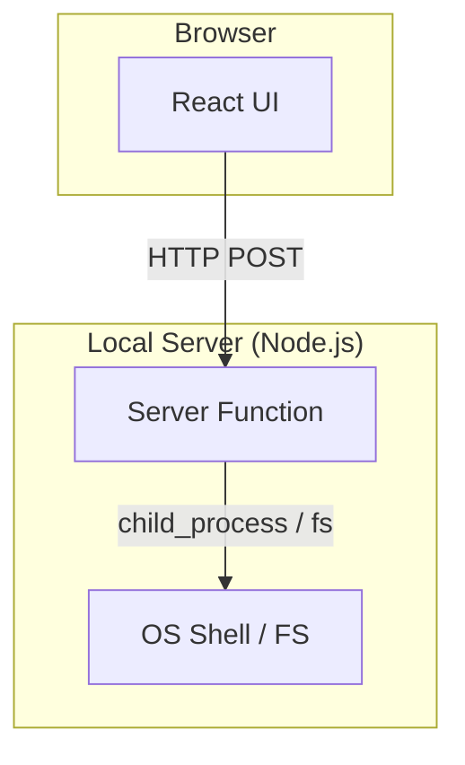

# OS-Agnostic Architecture

This document describes the current architecture for ensuring nXus works consistently across local environments (Windows, macOS, and Linux).

## Current Architecture: TanStack Start

nXus is built as a local-first web application using TanStack Start. This allows us to use standard web technologies for the UI while leveraging Node.js for system-level operations.

### How Native Operations Work

Since browser security prevents web pages from directly accessing local resources (like `file://` protocols or shell commands), we use TanStack Start **Server Functions**.



1. **Trigger**: User clicks a button in the UI.
2. **Transport**: A Server Function is invoked via an internal RPC call.
3. **Execution**: The server-side Node.js process executes the command (e.g., `git clone`, `open folder`) with full system privileges.

---

## Command Abstraction Strategy

To maintain a clean codebase that works everywhere, we follow these patterns:

### 1. Cross-Platform Libraries (Preferred)

We use well-maintained npm packages that abstract OS differences internally.

| Task                   | Recommended Library  | Benefit                                                    |
| ---------------------- | -------------------- | ---------------------------------------------------------- |
| Opening files/folders  | `open`               | Robust cross-platform URL/file handling                    |
| Running shell commands | `execa`              | Superior error handling and streaming over `child_process` |
| OS Information         | `os` (Node built-in) | Native platform/arch detection                             |

### 2. Platform-Specific fallbacks

When a generic library isn't available, we use explicit platform mapping:

```typescript
// Example: services/shell.server.ts
import os from 'os';
import { exec } from 'child_process';

export async function openPath(path: string) {
  const platform = os.platform();

  const commands = {
    win32: `start "" "${path}"`,
    darwin: `open "${path}"`,
    linux: `xdg-open "${path}"`,
  };

  exec(commands[platform]);
}
```

---

## Best Practices for OS-Agnostic Code

1.  **Avoid hardcoded paths**: Use `path.join()` for all filesystem operations.
2.  **Use `homeDir`**: Always resolve relative to `os.homedir()` when possible.
3.  **Sanitize shell inputs**: When using `exec` or `execa`, ensure user input is properly escaped to prevent command injection.
4.  **Use `lib/platform.ts`**: Centralize any logic that needs to check `os.platform()`.

---

## Related Implementation Files

- `services/os-info.server.ts` - Centralized platform detection
- `services/command-execution.server.ts` - Generic command runner with log streaming
- `services/install.server.ts` - Git-based app installation logic
