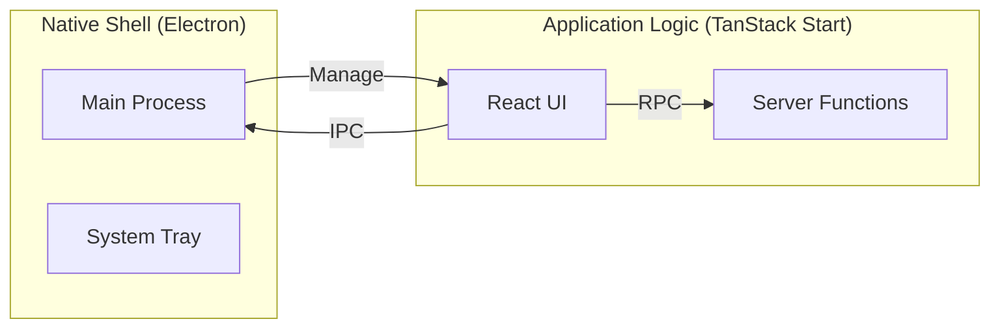

# Thinking Out Loud: The Future of nXus Architecture

This document tracks our evolving thoughts on the long-term architecture of nXus, specifically regarding deeper OS integration and potential shifts in deployment targets.

## The Hybrid Electron Pattern

While TanStack Start provides excellent server-side capabilities, some features (like system tray icons, global shortcuts, or frameless windows) require a native shell.

We are considering a "Best of Both Worlds" approach where nXus remains a TanStack Start app but is _optionally_ wrapped in Electron.

### Conceptual Architecture



### Decoupling Strategy

To ensure we don't become "locked in" to Electron, we propose an abstraction layer:

```typescript
// lib/platform-bridge.ts
export async function openFolder(path: string) {
  if (typeof window !== 'undefined' && window.electron) {
    // 1. If in Electron, use native shell (more robust)
    await window.electron.shell.openPath(path);
  } else {
    // 2. Fallback: Use TanStack Start server function
    await openPathServerFn({ data: { path } });
  }
}
```

This allows the app to run as:

1. **PWA/Web App**: For lightweight management.
2. **Desktop App**: For full OS-native control and visibility.

---

## Scripting: PowerShell Core (pwsh)

For complex automation that goes beyond single shell commands, we are considering standardizing on **PowerShell Core (pwsh)** as our "Universal Scripting Language."

### Why pwsh?

- **Cross-Platform**: Runs identically on Win/Mac/Linux.
- **Object-Oriented**: Pass structured data between commands instead of parsing strings.
- **Robustness**: Better error handling and logging than standard bash or cmd.

### Implementation Idea

Instead of writing complex Node.js `fs` logic, we could ship `.ps1` scripts that nXus executes via the server.

---

## Thinking Logs

### 2025-12-27: The "Open in Explorer" Problem

- **Problem**: `window.open("file://...")` failed due to browser security.
- **Resolution**: Move logic to Server Functions.
- **Architectural Shift**: Recognized that _all_ local actions must be server-driven, reinforcing nXus as a "Native Web App" rather than a traditional website.
- **Electron Path**: Realized that wrapping the current server in Electron is an additive change, not a rewrite.
